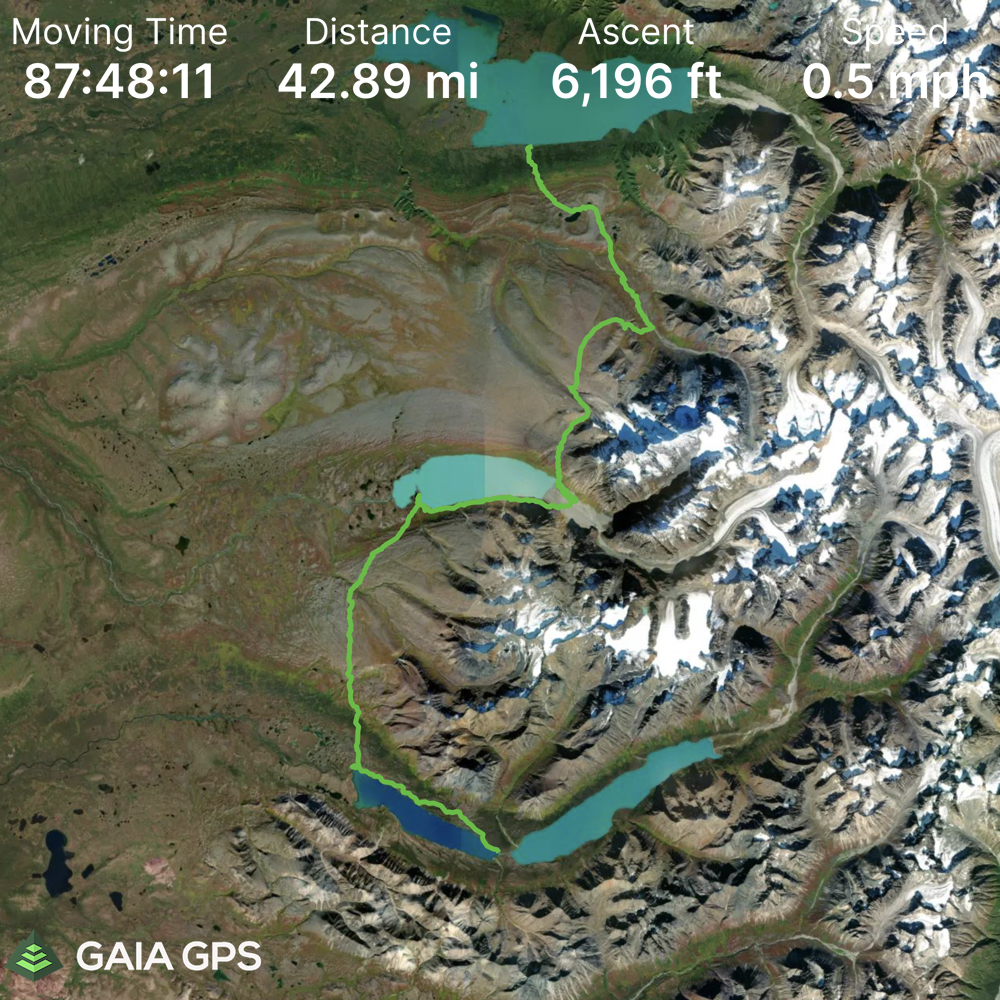
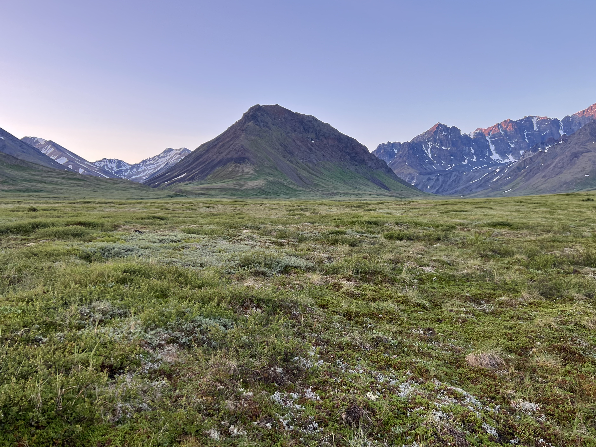
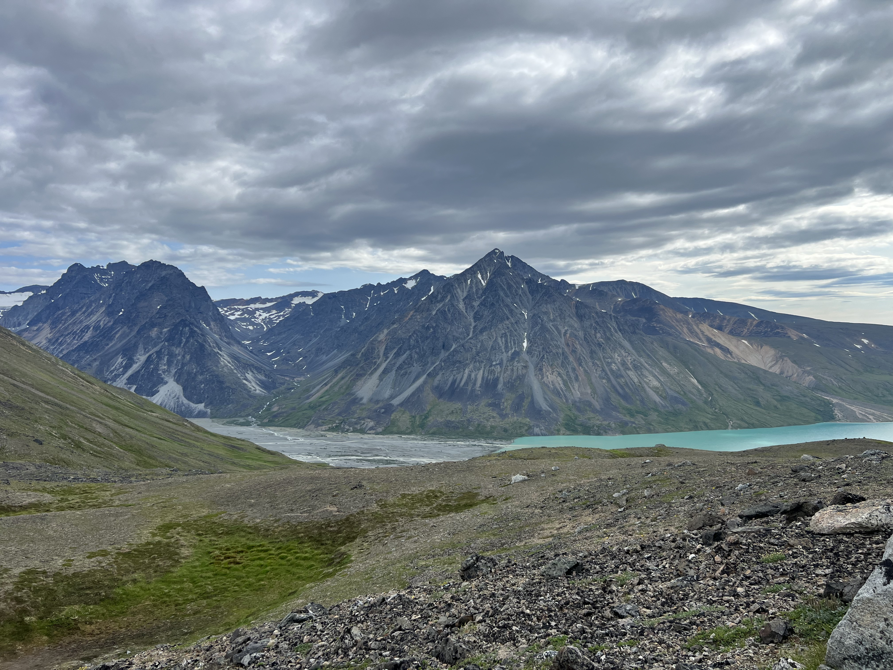

# Backpacking Telaquana to Twin - Lake Clark National Park

## Motivation

Normally we wouldn't be so thorough writing up a trip report (or write one at all), but we loved Lake Clark National Park. The planning for this trip was quite involved and the beta incredibly scarce. Hopefully this writeup helps someone in the future. This isn't intended to be a blog post. The majority of this page are notes I took each day on my phone.

## Overview

### Dates

July 19-27, 2023

### Trip Mileage Breakdown

- Day 1: 1.55 miles
- Day 2: 6.44 miles
- Day 3: Didn't Record
- Day 4: 7.39 miles
- Day 5: 7.26 miles
- Day 6: 7.78 miles
- Day 7: 8.48 miles
- Day 8: 11.48 miles
- Day 9: 6.64 miles

### Tracks (GPX)

- [Combined GPX](combined_tracks_lake-clark-telaquana-twin.gpx)
- [Individual Tracks](lake-clark-gpx-tracks.zip)

## Planning

### Things to Pay Attention To

- Off-trail navigation
- River crossings
  - Trail Creek
  - Turquoise River
  - Possibly Upper/Lower Twin Connecting Stream
- Snow Pack
- Satellite Communication for contacting pilot on pickup day
- Bring a bug net and [bug lotion](https://www.sawyer.com/products/picaridin-insect-repellent)
- Staying safe in bear country

### Fuel and Bear Spray

Fuel and bear spray can be difficult to get into the park. Many flight proivders will not allow you to fly with them (even in checked baggage) on their planes. We purchased our fuel (isobutane canisters used by MSR Windburner/Pocket Rocket/Reactor and Jetboil) and our bear spray from the Cranberry Cache coffee shop at the Lake Clark Resort. The price markup wasn't terrible. $7.50 for a 4oz canister and $65 for bear spray (they were $5 and $50 in Anchorage). They were out of 8oz fuel canisters on our way into the park, but had them when we grabbed a coffee after finishing our backpacking trip. I would call to confirm they have what you need in stock before your trip.

### How to Get to Lake Clark National Park and Travel Costs

To get to the park isn't trivial from Anchorage. For this particular trip, you'll need to fly into one of the nearby towns before taking a float plane to your intended starting lake. We chose to fly from Anchorage to Port Alsworth on a slightly larger plane that had 5 other passengers excluding the pilot. Then we took a 30 min float plane flight from Port Alsworth to Turquoise/Twin Lakes.

We chose to get to Lake Clark National Park through Lake Clark Air. This option was the simplest because they handle coordination of transport from Anchorage to Port Alsworth and then again from Port Alsworth to Anchorage. It was also convenient to be able to stay in Port Alsworth and relax before returning to Anchorage. There aren't many options for places to stay in Port Alsworth besides the Lake Clark Resort.

Travel information can be difficult to clarify from these providers' website. It's best to call/email them to get up to date information.

We contacted:

- [Lake Clark Air](https://lakeclarkair.com/air.html)
  - $575/person Flight from Anchorage to Port Alsworth. 75lb of luggage + $0.90/lb over 75 lbs.
  - $1460/person for round trip float plane flights Port Alsworth to Turquoise/Twin Lakes + 1 night at Lake Clark Resort (party of 2 in standard room)
    - Includes Breakfast + Sack Lunch + Dinner
  - [Lake Clark Resort & The Farm Lodge Tour](https://youtu.be/m_tgKmx6J0w)
  - Does not allow float plane flights without a stay at their lodge (Lake Clark Resort)
  - Total cost: $4070 for 2 people
- [Lake and Pen Air](https://lakeandpenair.com)
  - No float planes
  - Can handle transport to Port Alsworth or Iliamna
  - To Port Alsworth: $570/person + 50lb of luggage and $1.07/lb over 50 lbs.
- [Alaska Air Transporters](https://alaskaairtransporters.com)
  - Anchorage directly to Turquoise Lake
  - Bigger aircraft than needed
  - Paying for two round-trips for the pilot
  - $4800 for 2 people. Mark offered a charter flying discounted rate of $800/hour for 6 hours of flying time. 1.5 hours Anchorage to Turquoise + 1.5 hours for pilot to fly back for both pickup and dropoff.
  - Alternative, $2,500 for 2 people (roughly $1,250 for the drop off and $1,250 for the pickup) from Iliamna to Turquoise. Transportation to Iliamna would have to be separate through Lake and Pen Air. This option was only available starting in August 2023 when Mark would be based out of Iliamna.

### Food Storage

Ursack says that their products are not allowed in the park. NPS states that any IGBC-approved product is allowed as of 2023. Tried to confirm this fact with the Lake Clark rangers, but they weren't sure. Brought two BearVaults and accepted the weight penalty. There were almost no trees to attach your Ursack to on our route. A rodent might ruin your trip if you tie it to a boulder on the ground. I doubt the SAR team would be very happy if you SOS-ed because you had your food eaten by a rodent.

## Trip Report

### Conditions Leading up to our Trip

Southern Alaska received a historic amount of rain the weekend prior to our trip. We had been talking to Dan from [Alaska Alpine Adventures](https://alaskaalpineadventures.com) while planning our trip (Dan is amazing) and he told us they were having an especially long winter. Lake Clark had only seen 8 days of sunshine leading up to our trip at the end of July. We prepared for a trip with highs in the mid-40s and rain everyday. Luckily we got southern Alaska's first sunny stretch for 6 straight days from days 3-8.

### Day 1

- Dropped off in evening. Somewhat inconvenient since we had to quickly go up the brushy hill to find a place to set up camp before nightfall
- Telaquana beach is too narrow to camp on (only 1-2 feet between water and brush)
- We were dropped off a half mile from second creek
- Very wet ground once you go up into the brush
- Thick bushwhacking but no deadfall to contend with
- Scattered game trails, most of which go along the lake rather than up the hill
- Flat-ish open terrain 1000 feet up
- Rainstorm and somewhat windy. Made sure to guy out shelter for extra wind protection
- Very soft ground. Used long MSR cyclone tent stakes and guyed to tree
- Water access from a creek nearby but steep bank to get down to water. Lots of brush. Fast moving clear creek
- Pretty warm temps overall. Sun set around midnight-1am and rose at 5am
- Maybe trees for ursack. After this there are no more trees. We used two BearVaults.

#### Pictures

#### Map

<iframe src="https://www.gaiagps.com/public/Tzai9tIw0mu3cTjzzqUAgZGL/?embed=True" style='border:none; overflow-y: hidden; background-color:white; min-width: 320px; max-width:420px; width:100%; height: 420px;' scrolling='no' seamless='seamless'></iframe>

#### Terrain

- Only 1-2 feet of beach at Telaquana Lake
- Very brushy and wet for the first mile up the hill from the lake
- No good camp sites close to the lake, it is steep and brushy
- Brush gets sparser as you move up the hill
- We camped at the first decent place we could find as there was a storm coming that night

#### Weather

- Temperatures in the 50s - 60s, clear when we flew in but we knew there was a storm approaching
- Rained pretty hard, the forecast called for almost an inch of rain

#### Bugs

- Lots of mosquitoes
- Our camp site was near a hive of ground-dwelling bees who did not like our stake placements

### Day 2

- Continued up the hill, then dropped slightly into valley with trail creek
- Stopped at a small pond for lunch
- The ground was still pretty wet and slow going but less brushy as we got further from the lake. There were some sections with drier, less marshy ground as we gained elevation.
- Trail creek was in flood and moving very fast. Camped by creek.
- Selected a potential site for crossing, planned to attempt to cross early in the morning when the water would be lower.

#### Pictures

<video width="800" controls>
   <source src="https://github.com/djvolz/djvolz.github.io/raw/master/lake-clark-national-park-telaquana-twin/media/IMG_1773.mov" type="video/mp4">
</video>

#### Map

<iframe src="https://www.gaiagps.com/public/yVscaSVIPxAxdPLHtT8OyK1I/?embed=True" style='border:none; overflow-y: hidden; background-color:white; min-width: 320px; max-width:420px; width:100%; height: 420px;' scrolling='no' seamless='seamless'></iframe>

#### Terrain

- Occasional decent sized lake/pond for water
- Followed game trail to plateau
- Travel becomes significantly easier
- No more trees from now on. Bear canisters only
- Softish ground. Long stakes or MSR groundhogs would be fine
- Slept on open plain. Mildly windy but ok. Low probably in 40s

#### Weather

- Waited out rainstorm until 3pm
- Light precip on and off throughout the day
- Pretty warm. 50-60

#### Bugs

- Lots of mosquitoes

### Day 3

- Woke up at 4:20am an hour before sunrise to pack up camp
- Water in creek much calmer
- Attempted to cross. Water still very fast. Water level came up past mid-thigh on my partner at one step and was going to get deeper so we retreated. I’m 6’1”. Partner is 5’2”.
- Attempted multiple paths in a short period of time. Water is very cold. Eventually went back to shore with no safe crossing available. Warmed hot water bottle and broke out the safety blanket to warm our feet until sun broke onto valley floor
- Set up camp again on south shore. Rested for a few hours. New camp was a few hundred feet away but sheltered by a hill. Rockier ground. Could pick smaller stakes here. More bugs but no wind and warmer. Not that the cold was a problem. Lows were in 50s
- Scouted down river that day to see if river widened out
- Warm sunny day 60s. No rain.
- Saw a moose and some caribou
- Lots of mosquitoes

#### Pictures

<video width="800" controls>
  <source src="https://github.com/djvolz/djvolz.github.io/raw/master/lake-clark-national-park-telaquana-twin/media/IMG_1858.MOV" type="video/mp4">
</video>
<video width="800" controls>
   <source src="https://github.com/djvolz/djvolz.github.io/raw/master/lake-clark-national-park-telaquana-twin/media/IMG_1868.mov" type="video/mp4">
</video>

#### Map

N/A

### Day 4

- Woke up early to check river conditions. Didn’t pack up camp. Somewhat better. Rain flooding was calming. Not much snow in the mountains so high water was probably from rain and not all warming snowmelt. Still too high. Went back to bed.
- Scouted upriver into valley today. Smaller creek crossings split off from each of the valleys. Still knee height or deeper in the afternoon but much narrower crossings.
- Found some much more promising crossing sites 2-3 miles upriver. River was clearly flooded. Vegetation that normally wouldn’t be in water was submerged.
- Warm weather again. 60s. No rain
- Caribou encounter. Baby caribou ran off to our side in the distance. Parent stared at us. If we walked towards baby (didn’t notice the baby at first since it was a half mile away) then the parent would run towards us. If we walked away from baby then parent would retreat away to its child. Eventually we picked a direction the parent liked. We headed to much higher ground and gave a wide berth.
- Lots of mosquitoes

#### Pictures

<video width="800" controls>
   <source src="https://github.com/djvolz/djvolz.github.io/raw/master/lake-clark-national-park-telaquana-twin/media/IMG_1920.mov" type="video/mp4">
</video>

#### Map

N/A

### Day 5

- Woke up around 5am packed up and headed 2 miles upriver. Did the first small creek crossing just as sun hit the ground so we could warm our feet. Eventually saw one of our potential sites was looking decent. I scouted several beforehand but deemed them too deep for safety.
- Crossed between multiple ankle deep submerged sandbars. Knee deep in deep sections with one step above the knee for me. Staggered with partner it was very manageable but probably approaching the limit. Still fast moving water. Got across and warmed up but since it was later and we were warm from hiking it was much better. Did a few more small creek crossings and then headed up hill for breakfast (9am)
- Scouted a route that didn’t involve losing elevation and minimal backtracking.
- Crossed high (4k feet) plateau with occasional cloud providing shade.
- No rain. 60s and very warm in sun.
- Camped at base of glacier. Sheltered by big boulder. Normal ground. A little rocky.
- Windless night. Low in 50s. Spectacular view
- Lots of rodents. One chewed my cork handles
- Glacier water is very silty. Found a stream filtering through moss so we wouldn’t clog our filter.
- Lots of mosquitoes even up here

#### Pictures

#### Map

<iframe src="https://www.gaiagps.com/public/mzVy6sOOs5DQBjLn4Uq3wUQf/?embed=True" style='border:none; overflow-y: hidden; background-color:white; min-width: 320px; max-width:420px; width:100%; height: 420px;' scrolling='no' seamless='seamless'></iframe>

<iframe src="https://www.gaiagps.com/public/zI691UR3nfvSujrH4RfPjdhm/?embed=True" style='border:none; overflow-y: hidden; background-color:white; min-width: 320px; max-width:420px; width:100%; height: 420px;' scrolling='no' seamless='seamless'></iframe>

#### Terrain

- Travel was much easier as it was not very brushy
- Once we got up the hill the the ground was drier and firmer with sparsely scattered rocks
- There were several small creeks and other water sources as well as some small snow patches up on the plateau although this may be dependent on the time of year

#### Weather

- Sunny, mid-60s
- Not very windy on the plateau, but the wind picked up when we dropped down near the glacier

#### Bugs

- Still lots of mosquitoes even up here, although less than previous camp sites

### Day 6

- Descended from 4000 foot camp down to Turquoise Lake
- Brief climb up creek/boulder field then descent down valley
- Valley has very good ground for travel
- Possible camp spot at top of valley. Could be windy, but would have water access
- Bottom of valley before descent to turquoise has amazing view. Make sure to take pictures
- Take pictures of current creek paths for use when crossing later if running high
- Can descend gentler slopes but will face a couple thousand feet of very thick brush. 8 foot high alder bushes. If following our track you will be walking down a muddy creek
- Alternative route is to head east staying high across some mildly steeper traversing and then descend a less vegetated ridge
- Lots of amazing camp spots on valley floor at east end of turquoise
- Excellent weather. 60s and sunny
- Turquoise stream crossings were a non issue. Water is warmer and was running less strong/deep for us.
- Camped on north side of valley. Sandy with large river rocks.
- Less silty water in creeks on either side of the valley near vegetation. Filtering silty water can clog water filters

#### Pictures

<video width="800" controls>
   <source src="https://github.com/djvolz/djvolz.github.io/raw/master/lake-clark-national-park-telaquana-twin/media/IMG_2118.mov" type="video/mp4">
</video>

#### Map

<iframe src="https://www.gaiagps.com/public/OKVwat9OWVtr0kt1o0YoqC2E/?embed=True" style='border:none; overflow-y: hidden; background-color:white; min-width: 320px; max-width:420px; width:100%; height: 420px;' scrolling='no' seamless='seamless'></iframe>

#### Terrain

- Climb up the boulder field can be tedious. Most of the rocks were pretty stable but not all. Lots of rapidly melting snow was easy to punch through to the rocks below.
- Past the boulder field it became much windier
- Ground was stable gravel, very easy travel even as we dropped 2000 ft
- Very thick brush. Descended down a creek to avoid alder bushes.

#### Weather

- 60s and sunny
- not very windy near turquoise river

#### Bugs

- Less mosquitoes near Turquoise, mostly located along the edge of the valley near the vegetation

### Day 7

- Turquoise creeks not running high previous evening so we took it easy and crossed them around lunch time when it was warm.
- No issues crossing. Lots of great crossing options below the knee and at walking/jogging pace while we were there. We walked around a bit to cross smaller streams but it was pretty straightforward. Very nice compared to Trail Creek being in flood.
- River is very silty so it is difficult to determine depth by eye, we used our treking poles to estimate the depth before we entered
- Valley 1 looked like it was in great condition and would’ve been a good alternative way through the mountains. We wanted to see the tundra
- Headed west along south shore of turquoise
- Less brush on south side compared to north
- Very nice game trail for first portion
- Dropped to a pretty beach midway and filtered water
- Scared a brown bear that we ran into when we came over a ridge. It ran away as fast as it could. Good visibility so we never ended up too close to it
- We would recommend going higher than our track for this portion. Crossing the ravines full of alders can be tedious and we ran into a lot of bees
- Camped on spit jutting out into turquoise. Highly recommended campsite. It’s worth braving the tussocks and obnoxious ground to get there!
- Soft but not overly soft ground. Easy stake placement
- No rain. 60s/50s. Quite hot and sunny

#### Pictures

<video width="800" controls>
   <source src="https://github.com/djvolz/djvolz.github.io/raw/master/lake-clark-national-park-telaquana-twin/media/IMG_2253.mov" type="video/mp4">
</video>

#### Map

<iframe src="https://www.gaiagps.com/public/J94zvpaSp8Xk0op0jJuNTeU3/?embed=True" style='border:none; overflow-y: hidden; background-color:white; min-width: 320px; max-width:420px; width:100%; height: 420px;' scrolling='no' seamless='seamless'></iframe>

<iframe src="https://www.gaiagps.com/public/LiLXND6L1HCj6hqrlmzWqKkc/?embed=True" style='border:none; overflow-y: hidden; background-color:white; min-width: 320px; max-width:420px; width:100%; height: 420px;' scrolling='no' seamless='seamless'></iframe>

#### Terrain

- Less brush on this side compared with the other side of Turquoise
- Ravines were very brushy and slow going, recommend going higher on the hill to avoid them

#### Weather

- 60s and sunny

#### Bugs

- Ravines are full of mosquitoes and bees
- Less mosquitoes at this campsite than I would have expected considering how boggy the surrounding area is

### Day 8

- Getting off the spit involves either bushes or boggy tussocks. Only about 15-30 min of this then freedom
- Ascend slope to high plateau. Very easy travel
- Plateau is beautiful. A bit windy as you’d expect
- Creek in middle of two plateaus very easy to cross. Pretty too
- Descend towards twin. Prepare for brush and a new level of mosquitoes. See your first trees since turquoise
- Surprisingly clear and easy travel through trees. Make noise for bears. Visibility greatly reduced
- Minimal deadfall in trees. Travel very easy
- It’s hilly down there. Occasionally you’ll get a viewpoint to aid in navigation
- Slept above northwest beach of lower twin. Lots of good sites
- Windstorm that night. Pitched tarp in good ground using MSR cyclones and guyed out to nearby trees
- Temps still in 60s/50s

#### Pictures

#### Map

<iframe src="https://www.gaiagps.com/public/XrEyWz4RqMGMRbgLbBkpS0QF/?embed=True" style='border:none; overflow-y: hidden; background-color:white; min-width: 320px; max-width:420px; width:100%; height: 420px;' scrolling='no' seamless='seamless'></iframe>

<iframe src="https://www.gaiagps.com/public/SqQG6qqmimIxSgNHNd15TRK5/?embed=True" style='border:none; overflow-y: hidden; background-color:white; min-width: 320px; max-width:420px; width:100%; height: 420px;' scrolling='no' seamless='seamless'></iframe>

#### Terrain

- First section is boggy, no dry shoes today
- Plateau is flat and windy. The ground is dry and firm with small rocks
- Small creek in the middle of the plateau section was not very deep or fast, easy to cross
- Starts to get brushy as you get close to Lower Twin Lake
- Once the trees start the brush clears out a little bit. I wouldn't call it fast travel, but less brushy and less down trees than we expected

#### Weather

- 60s and sunny

#### Bugs

- Not very buggy on the plateau
- Extremely buggy in the forest near Lower Twin Lake

### Day 9

- Bonus hike down to connecting stream between lower and upper twin
- High winds from the east mean float plane can’t pick up from west shore of the lakes. Waves would push them into the shore
- Navigated from rocky patch to rocky patch using CalTopo on the fly
- A bit rainy and overcast today
- Took us ~3.5 hours for 6 miles of travel. 4.5 miles as crow flies. Weaved around and avoided the worst of the brush
- Communicated with pilot as we moved along. Original pickup was 10am on northwest shore of lower twin. Pilot picked us up at 2pm at connecting stream. We waited maybe 5 minutes on shore. Excellent timing on their part anticipating our arrival
- 25 min flight back to Port Alsworth

#### Map

<iframe src="https://www.gaiagps.com/public/TbF0CTFw6zZnWUndLDrV7y0D/?embed=True" style='border:none; overflow-y: hidden; background-color:white; min-width: 320px; max-width:420px; width:100%; height: 420px;' scrolling='no' seamless='seamless'></iframe>

#### Terrain

- Can't walk along lake as the beach is not continuous
- Brushy in general, interspersed with drier patches especially on ridges or small hills

#### Weather

- Overcast, high 50s
- Storm in forcast for tomorrow, >1 inch of rain expected

#### Bugs

- Not as buggy as the approach to Twin yesterday, but still plenty of mosquitoes

### Post-Trip

- Spoke with ranger. They didn’t know if ursacks were allowed or not…

## Alternative Routes

TODO

## Resources

### Mapping

- [Caltopo](https://caltopo.com/)
  - [Long-term review: CalTopo || My go-to mapping & GPS navigation platform](https://andrewskurka.com/review-caltopo-backcountry-mapping-gps-navigation/)
- [Gaia GPS](https://gaiagps.com/)

### National Park Service

- [Backpacking in Alaska](https://www.nps.gov/articles/backpackingak.htm)
- [Camping and Backpacking](https://www.nps.gov/lacl/planyourvisit/camping-and-backpacking.htm)
- [Safe River Crossings](https://www.nps.gov/articles/safe-river-crossings.htm)
- [Telequana Route](https://www.nps.gov/lacl/planyourvisit/historic-telaquana-trail-route.htm)
- [Staying Safe in Bear Country](https://www.nps.gov/lacl/planyourvisit/bear-safety.htm)
- [Dena'ina Athabascan Culture](https://www.nps.gov/lacl/learn/historyculture/denainaculture.htm)
- [Ancestral Telaquana Trail](https://www.nps.gov/lacl/learn/historyculture/telaquana-trail.htm)
- [Laws & Policies](https://www.nps.gov/lacl/learn/management/lawsandpolicies.htm)

### Andrew Skurka

- [Gear List: Gates of the Arctic National Park, Brooks Range, Alaska in early-summer](https://andrewskurka.com/gear-list-gates-of-arctic-brooks-range-alaska-early-summer/)
- [Recommended footwear for high routes, Alaska, and early-season conditions](https://andrewskurka.com/recommended-footwear-for-high-routes-alaska-and-early-season-conditions/)
- [Minimizing the effects and aftermath of wet feet](https://andrewskurka.com/minimizing-the-effects-and-aftermath-of-wet-feet/)
- [Gear List: Backpacking First Aid Kit for soloists & groups](https://andrewskurka.com/backpacking-first-aid-kit-gear-list-downloadable-checklist/)
- [Ineffective & outdated: Six reasons to not hang a bear bag](https://andrewskurka.com/argument-against-hanging-bear-bag/)
- [Buyers guide: Bear canisters || Comparison of volume per weight & cost](https://andrewskurka.com/food-bear-canisters-guide-approved-volume-cost/)
- [Review: Showa 282 Gloves || Preferred cold & wet solution, but imperfect](https://andrewskurka.com/review-showa-282-gloves-cold-wet-conditions/)
- [Bear spray: Three proper carrying methods](https://andrewskurka.com/bear-spray-proper-carrying-methods/)

### Trip Reports

- [Telaquana to Turquoise: Backpacking in Lake Clark National Park](https://sonjasaxe.com/blog/2019/7/16/telaquana-to-turquoise-backpacking-in-lake-clark-national-park)
- [Turquoise Lake To Twin Lakes Backpacking Trip](https://www.terragalleria.com/blog/turquoise-lake-to-twin-lakes-backpacking-trip/)
- [Backpacking Lake Clark Photos](https://www.terragalleria.com/mountain/mountain.lake-clark-backpack.all.html)
- [Backpacking In Lake Clark National Park With Alaska Alpine Adventures](https://bearfoottheory.com/backpacking-lake-clark-national-park-alaska-alpine-adventures/)
- [A floatplane dropped us off in the Alaskan wilderness for a few days of backpacking](https://www.reddit.com/r/backpacking/comments/sh5bcz/a_floatplane_dropped_us_off_in_the_alaskan/)

### Guiding Service

If you would like to do this trip but aren't sure if you're ready for backcountry travel on your own (or you don't want to deal with the logistics) we recommend using [Alaska Alpine Adventures](https://alaskaalpineadventures.com). Dan (the owner) was an amazing resource for us. He went above and beyond giving us beta and up to date area conditions. Considering flight costs and Port Alsworth hotel prices, Dan's guided trips are a steal.

[Turquoise Glacier High Route – Lake Clark National Park](https://alaskaalpineadventures.com/tour/turquoise-glacier-high-route-lake-clark-national-park/)

## Packing

- [What we brought](https://lighterpack.com/r/wiy86w)
  - We packed for a significantly colder trip based on the extended winter Alaska was having right up until the week we arrived.
    - You almost certainly do not need a belay puffy. My partner gets cold easily and the extra weight is easy comfort insurance for such a long trip.
    - Normally we wouldn't bring electronic entertainment, however there was a potential for us to be rained-in for multiple days.
  - This pack list is for two people. All gear quantities are correct with the exception that I didn't list my partner's clothing choices. These are just my clothing choices.
  - Typically I would say this much redundancy is overkill. However, since there was only two of us and we would be alone for 9 days without an easy bail option, we opted to carry the extra couple pounds.
  - Redundant items for safety:
    - 2 water filters
      - Glacier silt can clog a filter quickly.
    - 2 Garmin inReach
      - Need a way to contact pilot for pickup.
    - 4 bug head nets (2 per person)
      - This was a Skurka tip. If you rip/lose your headnet you might as well hit that SOS button on the inReach.
    - Rain Pants
      - Even if you don't use them for the rain you'll want them for the mosquitoes at dinner.
    - 2 backup batteries
      - Probably only need one. We wanted to make sure we could record GPX tracks without comprimising a battery backup used for safety purposes (such as recharging the inReach).
    - 2 stoves
      - We debated whether this was necessary since we could always just cold-soak our food. Opted to just carry it because boiling hot water for warmth can be critical in an emergency.
    - 3 Voile straps
      - Hyperlite Ultamid requires two straps minimum to set up
    - 2 Kindles
      - We could always just bring one and read over the other person's shoulder. My partner reads at least twice as fast as me so we decided to bring separate kindles.
    - 4 4oz isopro fuel cansisters
      - We planned to use slightly over 1 8oz container for 9 days. That meant we would carry 2 8 oz containers. Port Alsworth only had 4 oz containers and rather than modify our calculations at the last moment we decided to stick with the original plan of 16 oz of fuel for the trip. We used 1 4 oz container fully and another one mostly. We gave the last two to the rangers. We never needed to boil hot water for warmth and we drank our coffee cold because it was so warm out every morning.
    - Extra/multiple kinds of tent stakes
      - This route has really varied ground for camp. Alaska can be windy. This was easy extra weight to swallow.
      - Bring some long stakes like the MSR Cyclones or MSR Blizzards. The tundra can be very loose at the surface.
- [Gear List: Gates of the Arctic National Park, Brooks Range, Alaska in early-summer](https://andrewskurka.com/gear-list-gates-of-arctic-brooks-range-alaska-early-summer/)
- [Alaska Alpine Adventures Gear List](https://alaskaalpineadventures.com/wp-content/uploads/2022/12/EL2021-BACKPACKING-B.pdf)

### Our Pack List

